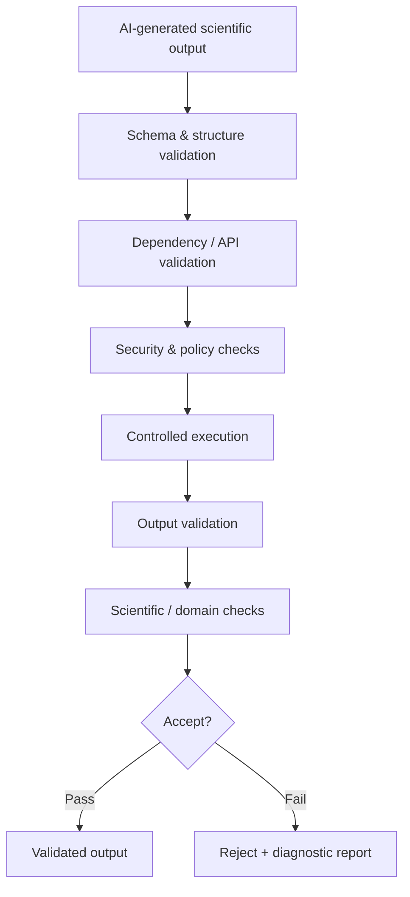
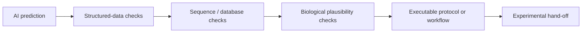

# AI Scientific Output Validation — Technical Case Study

**How I design programmatic safeguards around AI-generated scientific outputs before they are accepted downstream.**

> This repository is a **technical case study**, not the source code of the production system.
> The underlying commercial implementation was developed in an employment context and is proprietary.
> No employer source code, prompts, customer data, internal configuration, or proprietary validation rules are included here.

## Why this matters

Generative AI can produce plausible-looking scientific code and structured outputs that are still technically invalid, unsafe, internally inconsistent, or scientifically wrong.

The core engineering problem is therefore not only:

> **Can an AI generate an answer?**

but:

> **Can we programmatically decide whether that answer is safe and credible enough to continue downstream?**

My approach is to place a validation layer between generation and use.

## Validation architecture



## What I implemented in practice

In an internal AI-assisted scientific workflow, generated R scripts were not accepted simply because they looked reasonable.

The workflow included checks such as:

- **package/API validation** — confirm that requested packages and functions are valid and allowed;
- **security checks** — detect unsafe or prohibited operations before execution;
- **programmatic execution** — run generated scripts in a controlled environment;
- **execution validation** — check return status, expected files, and required outputs;
- **output validation** — verify that generated outputs have the expected structure and can be used by downstream steps;
- **diagnostic reporting** — record why an output passed or failed.

The production implementation is proprietary. The examples in this repository are deliberately generic and illustrative.

## Example validation sequence

```text
AI generates R analysis
        |
        v
Is the output structurally valid?
        |
        v
Are requested packages / APIs acceptable?
        |
        v
Does it pass security checks?
        |
        v
Execute in controlled environment
        |
        v
Did execution succeed?
        |
        v
Are expected outputs present and structurally valid?
        |
        v
PASS / REJECT + diagnostic report
```

## Extending the same pattern to computational biology

The same architecture can be applied to AI-generated biological predictions:



Examples of domain-specific validators could include:

- sequence length and composition checks;
- ORF / stop-codon validation;
- expected identifiers and metadata consistency;
- database cross-referencing;
- duplicate or near-duplicate detection;
- expected controls and experimental constraints;
- value-range and unit validation;
- compatibility with downstream laboratory or analysis software.

These are examples of how the framework can be generalized; they are not claims about proprietary production functionality.

## What this case study demonstrates

- translating scientific requirements into **machine-checkable validation rules**;
- designing **fail-fast validation pipelines**;
- separating generation from acceptance;
- programmatically executing and testing generated scientific code;
- working with structured outputs such as **JSON**;
- producing transparent **PASS / FAIL diagnostics**;
- thinking at the interface of **biology, software, and experimental workflows**;
- treating AI output as a hypothesis that must be validated, not trusted by default.

## Illustrative files in this repository

- [`examples/ai_output.json`](examples/ai_output.json) — synthetic example of structured AI output;
- [`examples/validation_report.json`](examples/validation_report.json) — synthetic machine-readable validation report;
- [`snippets/validation_pseudocode.py`](snippets/validation_pseudocode.py) — generic pseudocode illustrating the control flow;
- [`ARCHITECTURE.md`](ARCHITECTURE.md) — more detail on the validation layers;
- [`CASE_STUDY.md`](CASE_STUDY.md) — problem → approach → outcome summary.

## My broader background

My work combines computational biology, sequencing, workflow engineering, and automated QC. Examples include:

- Python / R / Bash;
- Nextflow;
- Docker and Singularity/Apptainer;
- Linux/HPC and Slurm;
- Oxford Nanopore and Illumina sequencing;
- automated NGS QC and validation;
- AI-assisted scientific workflows;
- translating wet-lab designs into computational logic.

Public portfolio: **https://github.com/luciazifcakova**

---

### Confidentiality note

This repository intentionally documents **architecture, reasoning, and generic validation patterns only**. It does not reproduce proprietary code, employer data, internal prompts, production configuration, or customer information.
# ai-scientific-validation-case-study
